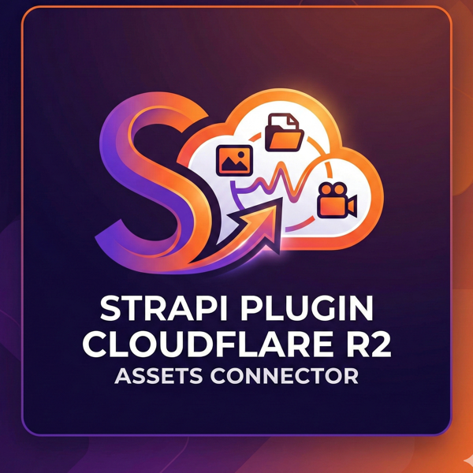
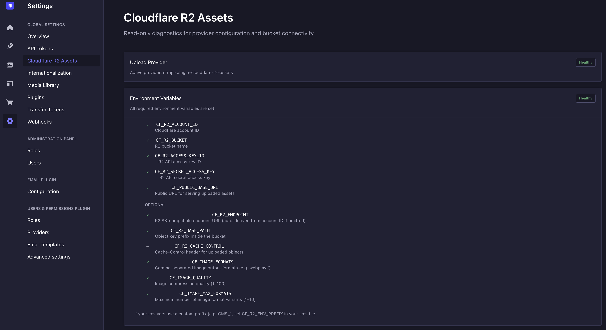

<p align="center">
  
</p>

# strapi-plugin-cloudflare-r2-assets

[](https://www.npmjs.com/package/strapi-plugin-cloudflare-r2-assets)
[](https://github.com/MehdiZare/strapi-plugin-cloudflare-r2-assets/actions/workflows/ci.yml)
[](./LICENSE)

Strapi 5 upload provider and plugin that stores media assets in **Cloudflare R2** and serves them through **Cloudflare edge image resizing** (`/cdn-cgi/image/...`). Drop it into any Strapi 5 project for S3-compatible object storage with automatic on-the-fly image optimization.

## Features

- Upload provider for Strapi's Upload plugin backed by Cloudflare R2
- Automatic edge image resizing via Cloudflare's `/cdn-cgi/image/` transform pipeline
- Default output formats: `webp` + `avif` (configurable)
- Configurable format list and max-formats guard
- Built-in admin diagnostics page (provider status, effective config, bucket connectivity)
- Secrets stay in environment variables only — never persisted in the database

## Requirements

- Node.js 20, 22, or 24 (Node 21 is not supported)
- Strapi 5.37.1 or newer
- Cloudflare R2 bucket
- Cloudflare-proxied public domain for image delivery (`/cdn-cgi/image/...`)

## Installation

```bash
npm install strapi-plugin-cloudflare-r2-assets
```

## Cloudflare setup

1. Create an R2 bucket.
2. Create an R2 API token with least privilege for the bucket.
3. Configure a public domain (proxied through Cloudflare) that points to your bucket assets.
4. Ensure Cloudflare Image Resizing is enabled for your zone.

## Environment variables

**Required:**

| Variable | Description |
|----------|-------------|
| `CF_R2_ACCOUNT_ID` | Cloudflare account ID |
| `CF_R2_BUCKET` | R2 bucket name |
| `CF_R2_ACCESS_KEY_ID` | R2 API access key ID |
| `CF_R2_SECRET_ACCESS_KEY` | R2 API secret access key |
| `CF_PUBLIC_BASE_URL` | Public URL for asset delivery (e.g. `https://media.example.com`) |

**Optional:**

| Variable | Default | Description |
|----------|---------|-------------|
| `CF_R2_ENDPOINT` | `https://<accountId>.r2.cloudflarestorage.com` | Custom R2 endpoint |
| `CF_R2_BASE_PATH` | `uploads` | Object key prefix |
| `CF_IMAGE_FORMATS` | `webp,avif` | Comma-separated output formats |
| `CF_IMAGE_QUALITY` | `82` | Image compression quality (1-100) |
| `CF_IMAGE_MAX_FORMATS` | `4` | Maximum number of format variants (1-10) |
| `CF_R2_CACHE_CONTROL` | — | Cache-Control header for uploaded objects |
| `CF_R2_ENV_PREFIX` | — | Prefix for env keys (e.g. `APP_` reads `APP_CF_R2_ACCOUNT_ID`) |

## Strapi configuration

Create or update `config/plugins.ts`:

```ts
export default () => ({
  upload: {
    config: {
      provider: 'strapi-plugin-cloudflare-r2-assets',
      providerOptions: {},
    },
  },
});
```

All settings are resolved from environment variables by default. You can optionally override defaults in `providerOptions`:

```ts
providerOptions: {
  basePath: 'uploads',       // default: 'uploads'
  formats: ['webp', 'avif'], // default: ['webp', 'avif']
  quality: 82,               // default: 82
  maxFormats: 4,             // default: 4
},
```

Set `CF_R2_ENV_PREFIX` to resolve prefixed values. For example, with `CF_R2_ENV_PREFIX=CMS_`, the plugin resolves `CMS_CF_R2_ACCOUNT_ID`, `CMS_CF_R2_BUCKET`, etc., and then falls back to unprefixed keys when needed.

## Admin diagnostics page

After installation, navigate to **Settings > Cloudflare R2 Assets** in the Strapi admin panel.

The page is read-only and shows:
- Upload provider activation status
- Effective (non-secret) configuration
- R2 bucket connectivity check

<p align="center">
  
</p>

Access requires the plugin read permission: `plugin::cloudflare-r2-assets.read`

## Security

- API keys are read only from environment variables — no credential persistence
- Config validation fails fast on missing or invalid values
- Numeric options are strict integers (`CF_IMAGE_QUALITY`, `CF_IMAGE_MAX_FORMATS`)
- `CF_PUBLIC_BASE_URL` and `CF_R2_ENDPOINT` must be valid `http(s)` URLs
- Admin diagnostics redact account identity and never expose secrets
- Diagnostics route is gated by explicit plugin read permission

## Contributing

Contributions are welcome! See [`AGENTS.md`](./AGENTS.md) for development setup, commands, release workflow, and contribution guidelines.

## License

MIT
